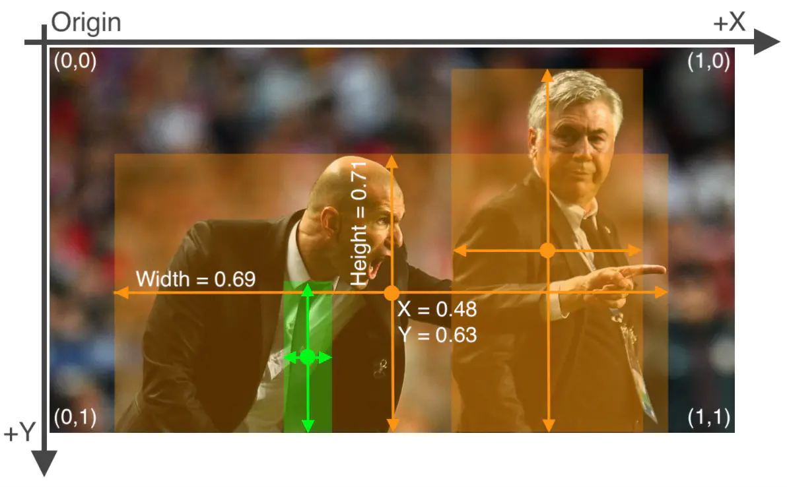

## One tool for data process
### COCO
```
annotation{
    "keypoints": [x1,y1,v1,...],
    "num_keypoints": int,
    "id": int,
    "image_id": int,
    "category_id": int,
    "segmentation": RLE or [polygon],
    "area": float,
    "bbox": [x,y,width,height],
    "iscrowd": 0 or 1,
}
(x,y)  = left top
```

**For details, see**  <https://zhuanlan.zhihu.com/p/29393415>

### YOLO
每行代表一个物体的类别和位置，第一列代表物体的类别，后面四列代表物体的位置信息，分别为x,y,w,h。**每张图片对应一个txt文件**，一个文件中有多个类别的物体。x,y,w,h分别为相对大小，即相当于原图的比例大小

```
1 0.617 0.3594420600858369 0.114 0.17381974248927037
1 0.094 0.38626609442060084 0.156 0.23605150214592274
1 0.295 0.3959227467811159 0.13 0.19527896995708155
1 0.785 0.398068669527897 0.07 0.14377682403433475
1 0.886 0.40879828326180256 0.124 0.18240343347639484
```


**For details, see** <https://www.jianshu.com/p/103754f49b7f>
